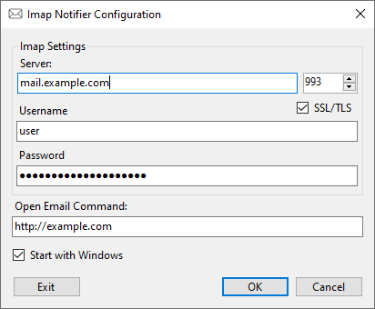

# ImapNotifier
Watch an IMAP email account and show a taskbar system notification icon when there are new recent emails

# Usage
Run ImapNotifier.exe. If you have no configuration file yet then the configuration window will be shown. Click OK to test the connection settings and save them if they pass validation. Note: the IMAP server must be IDLE capable. After clicing OK, the configuration window will close and ImapNotifier will show no UI at all. When new messages arrive, an icon will be shown in the notification area of the task bar. Click this icon to launch the command specified as the "Open Email Command" (this may be a URL, or an application, or a file to launch).

To open the configuration window again, run ImapNotifier.exe a second time once it is already running. Clicking Exit will stop ImapNotifier entirely, clicking Cancel will resume monitoring for new emails without changing settings.
